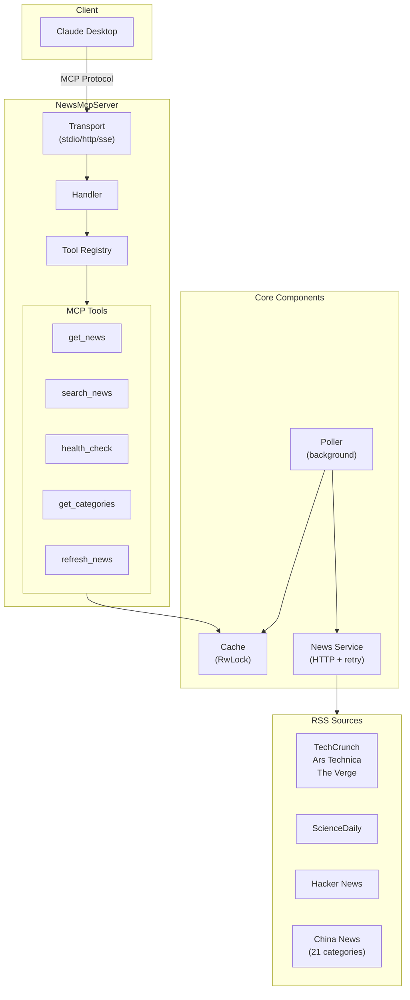
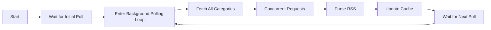

# News MCP Server Design Document

## 1. Project Overview

**Project Name**: News MCP Server
**Project Type**: Rust MCP (Model Context Protocol) Server
**Core Functionality**: Fetches news from RSS feeds with background polling and in-memory caching, provides news query tools via MCP protocol
**Target Users**: Claude Desktop users, AI assistant developers

## 2. System Architecture



## 3. Core Components

### 3.1 Cache Layer (`src/cache/`)

**Responsibility**: In-memory cache for news articles

**Implementation**:
- Uses `RwLock<HashMap<NewsCategory, Vec<NewsArticle>>>` for thread safety
- Supports per-category storage and retrieval
- Full-text search across title/description
- Configurable maximum cache size

**Key Structures**:
```rust
pub struct NewsCache {
    articles: RwLock<HashMap<NewsCategory, Vec<NewsArticle>>>,
    last_updated: RwLock<HashMap<NewsCategory, DateTime<Utc>>>,
    max_articles_per_category: usize,
}
```

### 3.2 Poller (`src/poller/`)

**Responsibility**: Background task for periodic RSS source polling

**Implementation**:
- Independent async task that periodically fetches all category news
- Uses `AtomicBool` to track initial poll completion status
- Provides blocking `wait_for_initial_poll()` interface
- Fetches all categories concurrently

**Key Flow**:


### 3.3 Service (`src/service/`)

**Responsibility**: RSS source fetching and parsing

**Implementation**:
- HTTP client using `reqwest` + `reqwest-middleware`
- Exponential backoff retry strategy (`reqwest-retry`)
- RSS/Atom parsing using `feed-rs`
- Date sorting (newest first)

### 3.4 Server (`src/server/`)

**Responsibility**: MCP protocol implementation

**Transport Modes**:
- **stdio**: Suitable for Claude Desktop integration
- **HTTP**: Suitable for web applications
- **SSE**: Server-Sent Events for push
- **hybrid**: Supports both stdio and HTTP

**Key Structures**:
```rust
pub struct NewsMcpServer {
    config: Config,
    cache: NewsCache,
    tool_registry: ToolRegistry,
}

pub struct NewsMcpHandler {
    server: Arc<NewsMcpServer>,
}
```

### 3.5 Tools (`src/tools/`)

| Tool | Function | Parameters |
|------|----------|------------|
| get_news | Get news list (dynamic categories) | category, limit, format |
| search_news | Search news (dynamic categories) | query, category, limit |
| get_categories | Get category list | - |
| health_check | Health check | check_type, verbose |
| refresh_news | Manual refresh | category |

**Supported Formats**: markdown, json, text

**Category Feature**: The category parameter for tools is dynamically generated from config; MCP clients will see the actual available categories.

## 4. Data Models

### NewsCategory

Supports 30+ categories (dynamically generated from config):
- **English Categories**: Technology (TechCrunch, Ars Technica, The Verge), Science (ScienceDaily), HackerNews
- **Chinese Categories**: Instant News, Headlines, Politics, East-West Dialogue, Society, Finance, Life, Health, Greater Bay Area, Chinese, Entertainment, Sports, Video, Photo, Creative, Live, Education, Law, United Front, Ethnic Unity, Belt and Road, Theory, ASEAN Trade

### NewsArticle

```rust
pub struct NewsArticle {
    title: String,
    description: Option<String>,
    link: String,
    source: String,
    category: NewsCategory,
    published_at: Option<DateTime<Utc>>,
    author: Option<String>,
}
```

## 5. Configuration

`config.toml`:
```toml
[server]
name = "news-mcp"
version = "0.1.0"
host = "127.0.0.1"
port = 8080
transport_mode = "http"  # stdio | http | sse | hybrid

[poller]
interval_secs = 3600
enabled = true

[cache]
max_articles_per_category = 100

[logging]
level = "info"
enable_console = true
```

## 6. RSS Sources

### International News
- **Technology**: TechCrunch, Ars Technica, The Verge
- **Science**: ScienceDaily

### China News (21 categories from chinanews.com.cn)
- Instant News, Headlines, Politics, East-West Dialogue, Society
- Finance, Life, Health, Greater Bay Area, Chinese
- Video, Photo, Creative, Live, Education, Law
- United Front, Ethnic Unity, Belt and Road, Theory, ASEAN Trade

## 7. Deployment

### Local Run
```bash
./target/release/news-mcp serve --mode stdio    # Claude Desktop
./target/release/news-mcp serve --mode http      # HTTP Server
```

### Docker
```bash
docker build -t news-mcp .
docker run -p 8080:8080 news-mcp
```

## 8. Testing

- **Unit Tests**: Cache, service, tools, config
- **Integration Tests**: End-to-end workflows
- **E2E Tests**: HTTP/stdio transport modes

```bash
cargo test              # All tests
cargo test --test unit  # Unit tests
cargo test --test e2e   # E2E tests
```

## 9. Tech Stack

- **Language**: Rust 1.75+
- **Async**: tokio
- **HTTP**: reqwest + reqwest-middleware
- **RSS Parsing**: feed-rs
- **MCP SDK**: rust-mcp-sdk
- **Logging**: tracing + tracing-subscriber
- **Config**: toml + serde

## 10. Extension Points

1. **Add News Source**: Add in `src/utils/mod.rs` `get_feed_urls()`
2. **Add Category**: Add to `NewsCategory` enum in `src/cache/news_cache.rs`
3. **Add Tool**: Implement `Tool` trait in `src/tools/` and register in `ToolRegistry`
4. **Add Transport**: Implement new transport in `src/server/transport/`