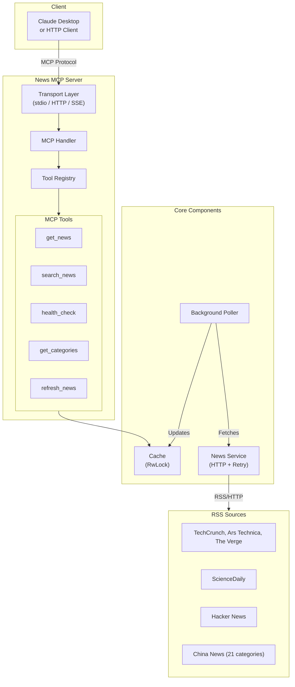

# News MCP Server

[](https://www.rust-lang.org)
[](https://opensource.org/licenses/MIT)
[](https://github.com/KingingWang/news-mcp/actions)
[](https://crates.io/crates/news-mcp)
[](https://hub.docker.com/r/kingingwang/news-mcp)

A Rust-based MCP (Model Context Protocol) server for fetching news from RSS feeds, with background polling, in-memory caching, and multiple transport modes.

## Features

- **Background Polling** - Periodically fetches news from RSS sources and caches locally
- **Multiple Transport Modes** - Supports HTTP, SSE, stdio, and hybrid modes
- **MCP Tools** - Provides `get_news`, `search_news`, `health_check`, `get_categories`, `refresh_news`
- **Multiple Categories** - Technology, Science, HackerNews, and 21 China News categories
- **Pluggable Sources** - Extensible `NewsSource` trait for adding custom data sources
- **In-memory Cache** - High-performance article cache with search functionality
- **Retry Mechanism** - Automatic retry for failed RSS fetch requests

## Quick Start

### Installation

Choose one of the following methods:

#### Option 1: Download Pre-built Binary

```bash
# Download latest release from GitHub
# Linux x86_64
curl -L https://github.com/KingingWang/news-mcp/releases/latest/download/news-mcp-linux-x86_64 -o news-mcp
chmod +x news-mcp
sudo mv news-mcp /usr/local/bin/

# macOS x86_64
curl -L https://github.com/KingingWang/news-mcp/releases/latest/download/news-mcp-darwin-x86_64 -o news-mcp
chmod +x news-mcp
sudo mv news-mcp /usr/local/bin/

# macOS ARM64
curl -L https://github.com/KingingWang/news-mcp/releases/latest/download/news-mcp-darwin-arm64 -o news-mcp
chmod +x news-mcp
sudo mv news-mcp /usr/local/bin/
```

#### Option 2: Install from crates.io

```bash
cargo install news-mcp
```

#### Option 3: Docker

```bash
docker pull kingingwang/news-mcp:latest
docker run -d -p 8080:8080 --name news-mcp kingingwang/news-mcp:latest
```

#### Option 4: Build from Source

```bash
git clone https://github.com/KingingWang/news-mcp
cd news-mcp
cargo build --release
# Binary will be at: ./target/release/news-mcp
```

### Run Server

```bash
# HTTP mode (default)
news-mcp serve --mode http --port 8080

# stdio mode (for Claude Desktop)
news-mcp serve --mode stdio

# With background polling enabled
news-mcp serve --mode http --poll
```

### Environment Variables

| Variable | Default | Description |
|----------|---------|-------------|
| `NEWS_MCP_PORT` | 8080 | Server port |
| `NEWS_MCP_HOST` | 127.0.0.1 | Server host |
| `NEWS_MCP_TRANSPORT` | http | Transport mode (stdio, http, sse, hybrid) |
| `NEWS_MCP_INTERVAL` | 3600 | Polling interval in seconds |
| `NEWS_MCP_LOG_LEVEL` | info | Log level (trace, debug, info, warn, error) |

Example:
```bash
NEWS_MCP_PORT=9090 NEWS_MCP_LOG_LEVEL=debug news-mcp serve --mode http
```

### Configuration File

Create `config.toml` in the working directory:

```toml
[server]
name = "news-mcp"
version = "0.1.0"
host = "127.0.0.1"
port = 8080
transport_mode = "http"  # Options: stdio, http, sse, hybrid

[poller]
interval_secs = 3600  # Poll every hour
enabled = true

[cache]
max_articles_per_category = 100

[logging]
level = "info"        # trace, debug, info, warn, error
enable_console = true
```

## Architecture



## MCP Tools

### get_news

Fetch articles by category.

**Parameters:**
- `category` - News category (see [Categories](#categories))
- `limit` - Number of articles (default 10, max 50)
- `format` - Output format: `markdown`, `json`, `text`

**Example:**
```json
{
  "category": "technology",
  "limit": 5,
  "format": "markdown"
}
```

### search_news

Search cached articles by keyword.

**Parameters:**
- `query` - Search keyword
- `category` - Optional category filter
- `limit` - Number of results

**Example:**
```json
{
  "query": "AI",
  "category": "technology",
  "limit": 10
}
```

### health_check

Check server status and cache statistics.

### get_categories

List available news categories with article counts.

### refresh_news

Manually refresh the news cache.

## Categories

### International

| Category | Sources |
|----------|---------|
| `technology` | TechCrunch, Ars Technica, The Verge |
| `science` | ScienceDaily |
| `hackernews` | Hacker News |

### China News (chinanews.com.cn)

| Category | Description |
|----------|-------------|
| `instant` | Instant News |
| `headlines` | Headlines |
| `politics` | Politics |
| `society` | Society |
| `finance` | Finance |
| `life` | Life |
| `wellness` | Health |
| `education` | Education |
| `law` | Law |
| ... | [See full list](https://github.com/KingingWang/news-mcp#categories) |

## Claude Desktop Integration

Add to `claude_desktop_config.json`:

```json
{
  "mcpServers": {
    "news": {
      "command": "news-mcp",
      "args": ["serve", "--mode", "stdio"]
    }
  }
}
```

## HTTP API Usage

```bash
# Initialize session
curl -X POST http://localhost:8080/mcp \
  -H "Content-Type: application/json" \
  -d '{
    "jsonrpc": "2.0",
    "method": "initialize",
    "params": {
      "protocolVersion": "2024-11-05",
      "capabilities": {},
      "clientInfo": {"name": "test", "version": "1.0"}
    },
    "id": 1
  }'

# Call tool (replace <session-id> with response from initialize)
curl -X POST http://localhost:8080/mcp \
  -H "Content-Type: application/json" \
  -H "mcp-session-id: <session-id>" \
  -d '{
    "jsonrpc": "2.0",
    "method": "tools/call",
    "params": {
      "name": "get_news",
      "arguments": {"category": "technology", "limit": 5}
    },
    "id": 2
  }'

# Health check
curl http://localhost:8080/health
```

## Docker Deployment

```bash
# Run with default config
docker run -d -p 8080:8080 --name news-mcp kingingwang/news-mcp:latest

# With custom config
docker run -d -p 8080:8080 \
  -v /path/to/config.toml:/etc/news-mcp/config.toml \
  --name news-mcp kingingwang/news-mcp:latest

# With environment variables
docker run -d -p 8080:8080 \
  -e NEWS_MCP_INTERVAL=1800 \
  -e NEWS_MCP_LOG_LEVEL=debug \
  --name news-mcp kingingwang/news-mcp:latest
```

See [Docker Guide](examples/docker.md) for more details.

## Development

```bash
# Run tests
cargo test
cargo test --test unit
cargo test --test e2e

# Format & lint
cargo fmt
cargo clippy

# Generate docs
cargo doc --open
```

## Documentation

- [Architecture](ARCHITECTURE.md) - System design and component overview
- [Contributing](CONTRIBUTING.md) - Development guidelines
- [Changelog](CHANGELOG.md) - Version history
- [Examples](examples/) - Usage guides

## License

MIT License - see [LICENSE](LICENSE)

## Acknowledgments

- [rust-mcp-sdk](https://github.com/rust-mcp-stack/rust-mcp-sdk) - MCP SDK
- [feed-rs](https://github.com/feed-rs/feed-rs) - RSS/Atom parsing
- [tokio](https://tokio.rs) - Async runtime
