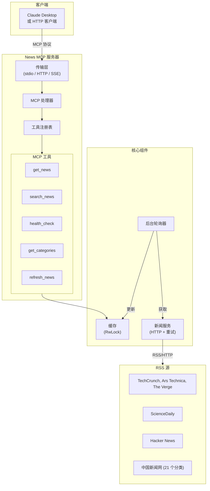

# News MCP 服务器

[](https://www.rust-lang.org)
[](https://opensource.org/licenses/MIT)
[](https://github.com/KingingWang/news-mcp/actions)
[](https://crates.io/crates/news-mcp)
[](https://hub.docker.com/r/kingingwang/news-mcp)

一个基于 Rust 的 MCP (Model Context Protocol) 服务器，用于获取新闻 RSS 源，支持后台轮询、内存缓存和多种传输模式。

## 功能特性

- **后台新闻轮询** - 定时从 RSS 源获取新闻并缓存
- **多种传输模式** - 支持 HTTP、SSE、stdio 和混合模式
- **MCP 工具** - 提供 `get_news`、`search_news`、`health_check`、`get_categories`、`refresh_news`
- **多类别支持** - Technology、Science、HackerNews 及 21 个中国新闻网分类
- **可插拔新闻源** - 通过 `NewsSource` trait 轻松添加自定义数据源
- **内存缓存** - 高性能文章缓存，支持搜索功能
- **重试机制** - RSS 源获取失败自动重试

## 快速开始

### 安装

选择以下任一方式安装：

#### 方式一：下载预编译二进制文件

```bash
# Linux x86_64
curl -L https://github.com/KingingWang/news-mcp/releases/latest/download/news-mcp-linux-x86_64 -o news-mcp
chmod +x news-mcp
sudo mv news-mcp /usr/local/bin/

# macOS x86_64
curl -L https://github.com/KingingWang/news-mcp/releases/latest/download/news-mcp-darwin-x86_64 -o news-mcp
chmod +x news-mcp
sudo mv news-mcp /usr/local/bin/

# macOS ARM64
curl -L https://github.com/KingingWang/news-mcp/releases/latest/download/news-mcp-darwin-arm64 -o news-mcp
chmod +x news-mcp
sudo mv news-mcp /usr/local/bin/
```

#### 方式二：从 crates.io 安装

```bash
cargo install news-mcp
```

#### 方式三：Docker

```bash
docker pull kingingwang/news-mcp:latest
docker run -d -p 8080:8080 --name news-mcp kingingwang/news-mcp:latest
```

#### 方式四：从源码构建

```bash
git clone https://github.com/KingingWang/news-mcp
cd news-mcp
cargo build --release
# 二进制文件位于: ./target/release/news-mcp
```

### 运行服务器

```bash
# HTTP 模式（默认）
news-mcp serve --mode http --port 8080

# stdio 模式（用于 Claude Desktop）
news-mcp serve --mode stdio

# 启用后台轮询
news-mcp serve --mode http --poll
```

### 环境变量

| 变量 | 默认值 | 说明 |
|------|--------|------|
| `NEWS_MCP_PORT` | 8080 | 服务器端口 |
| `NEWS_MCP_HOST` | 127.0.0.1 | 服务器主机 |
| `NEWS_MCP_TRANSPORT` | http | 传输模式（stdio, http, sse, hybrid） |
| `NEWS_MCP_INTERVAL` | 3600 | 轮询间隔（秒） |
| `NEWS_MCP_LOG_LEVEL` | info | 日志级别（trace, debug, info, warn, error） |

示例：
```bash
NEWS_MCP_PORT=9090 NEWS_MCP_LOG_LEVEL=debug news-mcp serve --mode http
```

### 配置文件

在工作目录创建 `config.toml`：

```toml
[server]
name = "news-mcp"
version = "0.1.0"
host = "127.0.0.1"
port = 8080
transport_mode = "http"  # 选项：stdio, http, sse, hybrid

[poller]
interval_secs = 3600  # 每小时轮询
enabled = true

[cache]
max_articles_per_category = 100

[logging]
level = "info"        # trace, debug, info, warn, error
enable_console = true
```

## 架构图



## MCP 工具

### get_news

获取指定类别的新闻。

**参数：**
- `category` - 新闻类别（见[分类列表](#分类)）
- `limit` - 返回文章数量（默认 10，最大 50）
- `format` - 输出格式：`markdown`、`json`、`text`

**示例：**
```json
{
  "category": "technology",
  "limit": 5,
  "format": "markdown"
}
```

### search_news

搜索缓存的新闻。

**参数：**
- `query` - 搜索关键词
- `category` - 可选类别过滤
- `limit` - 结果数量

**示例：**
```json
{
  "query": "AI",
  "category": "technology",
  "limit": 10
}
```

### health_check

检查服务器状态和缓存统计。

### get_categories

获取可用的新闻类别列表（包含文章数量）。

### refresh_news

手动刷新新闻缓存。

## 分类

### 国际新闻

| 分类 | 来源 |
|------|------|
| `technology` | TechCrunch、Ars Technica、The Verge |
| `science` | ScienceDaily |
| `hackernews` | Hacker News |

### 中国新闻网 (chinanews.com.cn)

| 分类 | 说明 |
|------|------|
| `instant` | 即时新闻 |
| `headlines` | 要闻导读 |
| `politics` | 时政新闻 |
| `society` | 社会新闻 |
| `finance` | 财经新闻 |
| `life` | 生活 |
| `wellness` | 健康 |
| `education` | 教育 |
| `law` | 法治 |
| ... | [查看完整列表](https://github.com/KingingWang/news-mcp#分类) |

## Claude Desktop 集成

在 `claude_desktop_config.json` 中添加：

```json
{
  "mcpServers": {
    "news": {
      "command": "news-mcp",
      "args": ["serve", "--mode", "stdio"]
    }
  }
}
```

## HTTP API 使用

```bash
# 初始化会话
curl -X POST http://localhost:8080/mcp \
  -H "Content-Type: application/json" \
  -d '{
    "jsonrpc": "2.0",
    "method": "initialize",
    "params": {
      "protocolVersion": "2024-11-05",
      "capabilities": {},
      "clientInfo": {"name": "test", "version": "1.0"}
    },
    "id": 1
  }'

# 调用工具（将 <session-id> 替换为 initialize 返回的会话 ID）
curl -X POST http://localhost:8080/mcp \
  -H "Content-Type: application/json" \
  -H "mcp-session-id: <session-id>" \
  -d '{
    "jsonrpc": "2.0",
    "method": "tools/call",
    "params": {
      "name": "get_news",
      "arguments": {"category": "technology", "limit": 5}
    },
    "id": 2
  }'

# 健康检查
curl http://localhost:8080/health
```

## Docker 部署

```bash
# 使用默认配置运行
docker run -d -p 8080:8080 --name news-mcp kingingwang/news-mcp:latest

# 使用自定义配置
docker run -d -p 8080:8080 \
  -v /path/to/config.toml:/etc/news-mcp/config.toml \
  --name news-mcp kingingwang/news-mcp:latest

# 使用环境变量
docker run -d -p 8080:8080 \
  -e NEWS_MCP_INTERVAL=1800 \
  -e NEWS_MCP_LOG_LEVEL=debug \
  --name news-mcp kingingwang/news-mcp:latest
```

更多详情参见 [Docker 指南](examples/docker.md)。

## 开发

```bash
# 运行测试
cargo test
cargo test --test unit
cargo test --test e2e

# 格式化与检查
cargo fmt
cargo clippy

# 生成文档
cargo doc --open
```

## 文档

- [架构设计](ARCHITECTURE.md) - 系统设计和组件概述
- [贡献指南](CONTRIBUTING.md) - 开发指南
- [更新日志](CHANGELOG.md) - 版本历史
- [示例](examples/) - 使用指南

## 许可证

MIT License - 详见 [LICENSE](LICENSE)

## 致谢

- [rust-mcp-sdk](https://github.com/rust-mcp-stack/rust-mcp-sdk) - MCP SDK
- [feed-rs](https://github.com/feed-rs/feed-rs) - RSS/Atom 解析
- [tokio](https://tokio.rs) - 异步运行时
