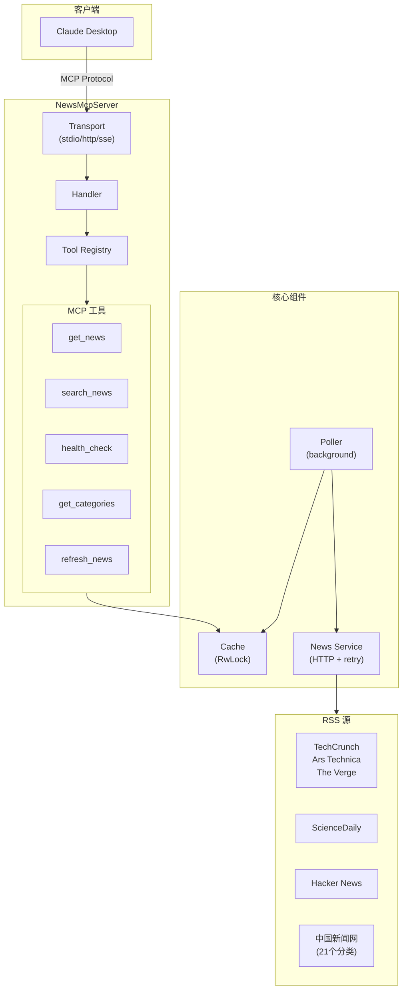

# News MCP Server 设计文档

## 1. 项目概述

**项目名称**: News MCP Server  
**项目类型**: Rust MCP (Model Context Protocol) 服务器  
**核心功能**: 获取新闻 RSS 源，支持后台轮询、内存缓存，通过 MCP 协议提供新闻查询工具  
**目标用户**: Claude Desktop 用户、AI 助手开发者

## 2. 系统架构



## 3. 核心组件

### 3.1 Cache Layer (`src/cache/`)

**职责**: 内存缓存新闻文章

**实现**:
- 使用 `RwLock<HashMap<NewsCategory, Vec<NewsArticle>>>` 保证线程安全
- 支持按类别存储和检索
- 支持标题/描述全文搜索
- 支持配置最大缓存数量

**关键结构**:
```rust
pub struct NewsCache {
    articles: RwLock<HashMap<NewsCategory, Vec<NewsArticle>>>,
    last_updated: RwLock<HashMap<NewsCategory, DateTime<Utc>>>,
    max_articles_per_category: usize,
}
```

### 3.2 Poller (`src/poller/`)

**职责**: 后台定时轮询 RSS 源

**实现**:
- 独立的异步任务，定时获取所有分类新闻
- 使用 `AtomicBool` 标记首次轮询完成状态
- 提供 `wait_for_initial_poll()` 阻塞接口
- 并发获取所有分类

**关键流程**:


### 3.3 Service (`src/service/`)

**职责**: RSS 源获取和解析

**实现**:
- 使用 `reqwest` + `reqwest-middleware` 实现 HTTP 客户端
- 集成指数退避重试策略 (`reqwest-retry`)
- 使用 `feed-rs` 解析 RSS/Atom 格式
- 支持日期排序（最新优先）

### 3.4 Server (`src/server/`)

**职责**: MCP 协议实现

**传输模式**:
- **stdio**: 适合 Claude Desktop 集成
- **HTTP**: 适合 Web 应用
- **SSE**: Server-Sent Events 推送
- **hybrid**: 同时支持 stdio 和 HTTP

**关键结构**:
```rust
pub struct NewsMcpServer {
    config: Config,
    cache: NewsCache,
    tool_registry: ToolRegistry,
}

pub struct NewsMcpHandler {
    server: Arc<NewsMcpServer>,
}
```

### 3.5 Tools (`src/tools/`)

| 工具 | 功能 | 参数 |
|------|------|------|
| get_news | 获取新闻列表（类别动态生成） | category, limit, format |
| search_news | 搜索新闻（类别动态生成） | query, category, limit |
| get_categories | 获取分类列表 | - |
| health_check | 健康检查 | check_type, verbose |
| refresh_news | 手动刷新 | category |

**支持格式**: markdown, json, text

**类别特性**: 工具的类别参数根据配置文件动态生成，MCP 客户端会看到实际可用的类别列表。

## 4. 数据模型

### NewsCategory

支持 30+ 个分类（根据配置动态生成）：
- **英文分类**: Technology (TechCrunch, Ars Technica, The Verge), Science (ScienceDaily), HackerNews
- **中文分类**: 即时新闻, 要闻导读, 时政新闻, 东西问, 国际新闻, 社会新闻, 财经新闻, 生活, 健康, 大湾区, 华人, 文娱新闻, 体育新闻, 视频, 图片, 创意, 直播, 教育, 法治, 同心, 铸牢中华民族共同体意识, 一带一路, 理论, 中国—东盟商贸资讯平台

### NewsArticle

```rust
pub struct NewsArticle {
    title: String,
    description: Option<String>,
    link: String,
    source: String,
    category: NewsCategory,
    published_at: Option<DateTime<Utc>>,
    author: Option<String>,
}
```

## 5. 配置

`config.toml`:
```toml
[server]
name = "news-mcp"
version = "0.1.0"
host = "127.0.0.1"
port = 8080
transport_mode = "http"  # stdio | http | sse | hybrid

[poller]
interval_secs = 3600
enabled = true

[cache]
max_articles_per_category = 100

[logging]
level = "info"
enable_console = true
```

## 6. RSS 源

### 国外新闻
- **Technology**: TechCrunch, Ars Technica, The Verge
- **Science**: ScienceDaily

### 中国新闻网 (21个分类)
- 即时新闻、要闻导读、时政新闻、东西问、社会新闻
- 财经新闻、生活、健康、大湾区、华人
- 视频、图片、创意、直播、教育、法治
- 同心、铸牢中华民族共同体意识、一带一路、理论、中国—东盟商贸资讯平台

## 7. 部署方式

### 本地运行
```bash
./target/release/news-mcp serve --mode stdio    # Claude Desktop
./target/release/news-mcp serve --mode http      # HTTP 服务
```

### Docker
```bash
docker build -t news-mcp .
docker run -p 8080:8080 news-mcp
```

## 8. 测试

- **单元测试**: 缓存、服务、工具、配置
- **集成测试**: 端到端工作流
- **E2E 测试**: HTTP/stdio 传输模式

```bash
cargo test              # 所有测试
cargo test --test unit  # 单元测试
cargo test --test e2e   # E2E 测试
```

## 9. 技术栈

- **语言**: Rust 1.75+
- **异步**: tokio
- **HTTP**: reqwest + reqwest-middleware
- **RSS 解析**: feed-rs
- **MCP SDK**: rust-mcp-sdk
- **日志**: tracing + tracing-subscriber
- **配置**: toml + serde

## 10. 扩展点

1. **新增新闻源**: 在 `src/utils/mod.rs` 的 `get_feed_urls()` 添加
2. **新增分类**: 在 `src/cache/news_cache.rs` 的 `NewsCategory` 枚举添加
3. **新增工具**: 在 `src/tools/` 实现 `Tool` trait 并注册到 `ToolRegistry`
4. **传输模式**: 在 `src/server/transport/` 实现新 transport